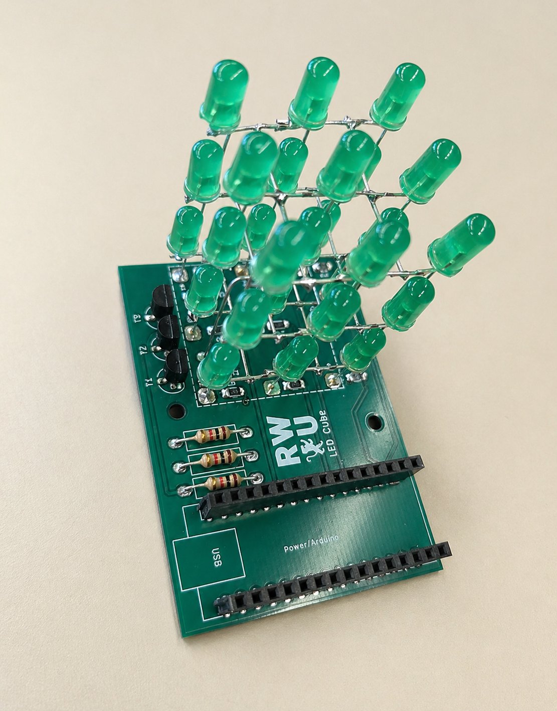

# 3×3 LED Cube using Arduino Nano

## Project Overview



---

## Description
This project is a 3×3 LED cube built using an Arduino Nano. The cube consists of 9 LEDs arranged in a 3×3 structure and controlled through Arduino digital output pins.

The project demonstrates LED control, pattern generation, timing logic, and basic embedded programming using Arduino (C/C++). Different LED animations are created by turning LEDs ON and OFF in a controlled sequence.

---

## Features
- Control of 9 LEDs using Arduino Nano  
- LED pattern generation and sequencing  
- Sequential LED animation  
- All-LED blinking pattern  
- Forward and backward running light pattern  
- Timing-based animation control  
- Modular pattern implementation using functions  

---

## Hardware & Tools
- Microcontroller: Arduino Nano  
- LEDs: 9 LEDs arranged in 3×3 structure  
- Resistors: Current limiting resistors  
- Jumper wires  
- Breadboard or soldered LED structure  
- Programming Language: Arduino (C/C++)  
- IDE: Arduino IDE  
- Power Supply: USB / external battery  

---

## Working Principle
- Each LED is connected to an Arduino digital output pin  
- The Arduino controls LEDs by setting pins HIGH (ON) or LOW (OFF)  
- LEDs are activated in sequence to generate visual patterns  
- Delay functions are used to control animation timing  
- Loop structures are used to create repeating patterns  

---

---

## Design Insights
- LED wiring order directly affects how the animation appears visually
- Current limiting resistors are necessary to protect the LEDs from damage
- Consistent pin mapping helps make the code easier to understand and debug
- Delay timing controls the speed and smoothness of the LED patterns
- If the delay is too short, the animation becomes difficult to see clearly
- Separating each pattern into its own function improves code structure and readability

---

## Results
The 3×3 LED cube successfully displays different LED patterns, including sequential lighting, all-LED blinking, and forward-backward running light animation.

All LEDs respond correctly to the Arduino Nano output pins, confirming that the wiring, pin mapping, and program logic work properly.

---

## Learning Outcomes
- Understanding of digital output control using Arduino Nano
- Practical experience with LED wiring and current limiting resistors
- Pattern generation using loops and functions
- Timing control using delay functions
- Debugging hardware and software interaction
- Understanding how software controls physical hardware

## Arduino Code

```cpp
int leds[] = {2, 3, 4, 5, 6, 7, 8, 9, 10};
int numberOfLeds = 9;
int delayTime = 150;

void setup() {
  for (int i = 0; i < numberOfLeds; i++) {
    pinMode(leds[i], OUTPUT);
  }
}

void loop() {
  patternOneByOne();
  patternAllBlink();
  patternForwardBackward();
}

void patternOneByOne() {
  for (int i = 0; i < numberOfLeds; i++) {
    digitalWrite(leds[i], HIGH);
    delay(delayTime);
    digitalWrite(leds[i], LOW);
  }
}

void patternAllBlink() {
  for (int i = 0; i < 3; i++) {
    for (int j = 0; j < numberOfLeds; j++) {
      digitalWrite(leds[j], HIGH);
    }
    delay(300);

    for (int j = 0; j < numberOfLeds; j++) {
      digitalWrite(leds[j], LOW);
    }
    delay(300);
  }
}

void patternForwardBackward() {
  for (int i = 0; i < numberOfLeds; i++) {
    digitalWrite(leds[i], HIGH);
    delay(delayTime);
    digitalWrite(leds[i], LOW);
  }

  for (int i = numberOfLeds - 2; i > 0; i--) {
    digitalWrite(leds[i], HIGH);
    delay(delayTime);
    digitalWrite(leds[i], LOW);
  }
}
